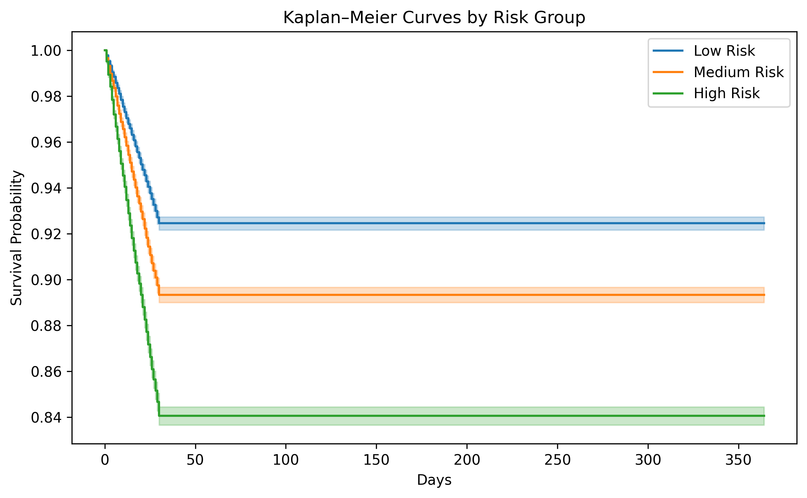
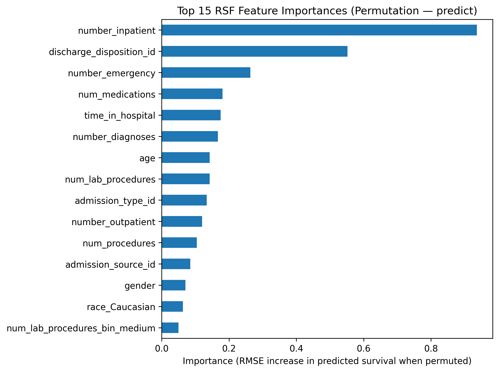

# Diabetes Readmission — Survival Analysis & Predictive Modeling

[]()
[]()

### **Goal**

Predict **30-day hospital readmission risk** among diabetic patients and provide **clinical + operational insights** for decision makers.

## Intended Use

This project is intended as a **research and decision-support prototype** demonstrating survival analysis and predictive modeling techniques for hospital readmission risk among diabetic patients.

The analysis is designed for **educational purposes, technical evaluation, and exploratory risk stratification** only. It is not intended to guide individual patient diagnosis, treatment decisions, or clinical care pathways.

Any real-world deployment would require **external validation, institutional review, and appropriate regulatory and clinical governance approval**.

---

## Dataset Overview

* **Source:** Diabetes 1999–2008 hospital encounters
* **Rows:** 101,766
* **Columns:** 50
* **Target:** `readmitted`

  * `<30` → readmitted within 30 days (event)
  * `>30` or `NO` → censored

### **Event definition (survival model)**

| Label       | Meaning                                    |
| ----------- | ------------------------------------------ |
| `event = 1` | readmission `<30`                          |
| `event = 0` | otherwise                                  |
| `time`      | simulated follow-up time for demonstration |

**Event distribution**

* `<30`: **11,357** (11.16%)
* Censored (`>30` + `NO`): **90,409**
> **Note:** Survival time (`time`) is not included in the original dataset and was simulated for demonstration to enable survival modeling.
---

## Cohort Filtering Summary

| Filter                           | Remaining |
| -------------------------------- | --------- |
| Initial dataset                  | 101,766   |
| Remove children (`age = [0–10)`) | 101,605   |
| Remove death/hospice             | 99,552    |
| Remove invalid discharge codes   | 99,552    |
| Remove unknown gender            | 99,549    |
| Drop duplicates                  | 99,549    |

**Final cohort:** 99,549 <br>
**Total removed:** 2,217 <br>
These cohort exclusions follow standard clinical survival modeling practices.
---

# Project Structure

```
diabetes-readmission-survival-analysis/
├── data/
│   ├── README.md  # Instructions to obtain / recreate dataset
├── notebooks/
│   ├── 01_EDA.ipynb
│   ├── 02_preprocessing.ipynb
│   ├── 03_survival_baseline.ipynb
│   └── 04_ml_survival_models.ipynb
├── src/
│   ├── data.py
│   ├── features.py
│   ├── models.py
│   └── eval.py
├── visuals/
│   ├── EDA/
│   ├── KM_Plots/
│   └── PH_diagnostics/
├── models/
│   ├── README.md  # Instructions to train models locally
├── reports/
│   ├── Diabetic_readmission_survival_analysis.pdf
│   ├── model_comparison_cindex.csv
│   ├── cox_feature_importance.csv
│   ├── rsf_feature_importance.csv
│   └── schoenfeld_test_results.csv
├── requirements.txt
├── README.md
├── MODEL_CARD.md
├── LICENSE
└── .gitignore
```

---


# Reproducibility
**Requires:** Python 3.10+

### **1. Create environment**

```bash
python -m venv venv
source venv/bin/activate   # Windows: .\venv\Scripts\activate
pip install -r requirements.txt
```

### **2. Add dataset**

Place the raw dataset here:

```
data/raw/diabetic_data.csv
```
## Data, Models & Artifacts Availability
The following artifacts are generated when running the notebooks locally and are
**not included** in this repository due to size and data governance constraints:

- Trained survival models (CoxPH, RSF) stored as `.pkl` files
- Cleaned survival datasets derived from raw EHR data
- Intermediate diagnostic objects

All reported metrics, plots, and tables in this repository were generated from
these artifacts and are provided for transparency and reproducibility.

### **3. Run notebooks in order**

1. **01_EDA.ipynb** — data quality, distributions
2. **02_preprocessing.ipynb** — cleaning + survival labeling
3. **03_survival_baseline.ipynb** — CoxPH model + PH tests
4. **04_ml_survival_models.ipynb** — RSF, metrics, feature importance

---

# Baseline Survival Analysis (CoxPH)

* Cleaned + standardized dataset
* Fitted **CoxPH** model
* Stratified risk into **Low / Medium / High**
* Kaplan–Meier curves by risk tier
* Top predictors via Cox coefficients
* Schoenfeld residual proportional hazards test

### Model Performance  
- **C-index (CoxPH):** 0.6375  
- **C-index (RSF):** 0.7055  

## Kaplan–Meier Survival Curves (Risk Groups)



**Figure 1. Kaplan–Meier survival curves by risk group.**  
High-risk patients show significantly earlier readmission compared to Medium and Low-risk groups  
(log-rank p < 1e-80).  
The clear separation confirms that the RSF-driven risk stratification captures meaningful differences in survival time.

### Included Results & Visualizations
* `visuals/KM_Plots/km_by_risk_group.png`
* `reports/cox_feature_importance.csv`
* `reports/schoenfeld_test_results.csv`

---

# Machine Learning Survival Models (RSF)

* Random Survival Forest (100 trees)
* C-index comparison vs CoxPH
* Brier score calibration
* Permutation importance

## Feature Importance (Random Survival Forest)



**Figure 2. Random Survival Forest Feature Importances (Permutation-Based).**  
The RSF model identifies `cox_risk`, number of inpatient visits, and discharge disposition as the most influential predictors of readmission.  
Higher permutation importance indicates a larger increase in prediction error when the feature is shuffled, showing strong contribution to survival prediction.

### Model Performance  
- **C-index (RSF):** 0.7055  
- **Brier Score (t=176 days):** 0.0976  

### Included Results & Visualizations
* `reports/model_comparison_cindex.csv`
* `reports/rsf_feature_importance.csv`
* `visuals/EDA/rsf_feature_importance.png`

## Trained Models

Pre-trained survival models (e.g., Cox PH, RSF) are **not included** in this repository.

Models can be trained using the notebooks in:
- `notebook/03_survival_baseline_models.ipynb`
- `notebook/04_ml_survival_models.ipynb`

---

# Client Report

Includes:

* Executive summary
* Risk stratification curves
* Feature importance
* Deployment recommendations

Saved as:
`reports/diabetic_readmission_survival_analysis.pdf`

---

# Notes

* Raw data excluded via `.gitignore`
* Survival times simulated for demonstration
* Fully modularized `src/` code for reproducibility

## Consulting Use Case

This project demonstrates applied capabilities relevant to:

- Healthcare predictive modeling and survival analysis
- Hospital readmission risk stratification
- Cox Proportional Hazards and Random Survival Forest modeling
- Model diagnostics and validation (C-index, Brier score, PH tests)
- Translating statistical outputs into operational insights

In a consulting engagement, this work would be delivered as a **risk stratification and analytics prototype**, accompanied by a client-facing report outlining findings, limitations, and deployment considerations.

---
## Client-Ready Deliverables 
In a real-world consulting engagement, this project would be delivered as:
- Cleaned and documented dataset
- Trained and validated ML model
- Model performance report with clinical interpretation
- Explainability artifacts (SHAP / Grad-CAM where applicable)
- Interactive demo or dashboard (Streamlit)
- Model card and risk & limitation documentation 

---
## Deployment Considerations

### Operational Integration

Potential deployment environments include clinical decision support systems, business analytics platforms, or API-based inference pipelines. Integration considerations include data availability, workflow compatibility, and stakeholder usability.

### Model Monitoring

Recommended post-deployment monitoring:

- Model performance drift detection
- Data distribution monitoring
- KPI tracking aligned with business or clinical outcomes
- Periodic model recalibration

Continuous monitoring is essential to maintain reliability.

### Human Oversight

For high-impact decisions:

- Human-in-the-loop review recommended
- AI outputs positioned as decision support rather than autonomous decision-making
- Clear escalation pathways for uncertain predictions

This is particularly critical in healthcare and financial risk contexts.

### Governance & Compliance Awareness

Deployment should consider:

- Data privacy requirements
- Auditability and reproducibility
- Documentation of validation evidence
- Regulatory context where applicable (e.g., healthcare AI)

Formal validation would be required before operational use.

---

## Clinical Impact

### Potential Value Drivers

This project is designed to support measurable operational or financial impact, including:

- Improved decision accuracy
- Operational efficiency gains
- Risk reduction
- Resource optimization
- Revenue protection or growth

### Example Deployment Benefits

Actual impact depends on deployment context, data quality, and operational integration. Potential benefits may include:

- Reduced operational costs through earlier risk identification
- Improved allocation of staff, inventory, or marketing resources
- Enhanced decision support for clinical or business stakeholders
- Increased transparency and confidence in analytics-driven decisions

### Measurement Considerations

Typical ROI evaluation would include:

- Baseline vs post-deployment performance comparison
- Cost savings analysis
- Revenue uplift measurement
- Error reduction metrics
- Operational efficiency indicators

Formal ROI validation requires real-world deployment data.

---

## Validation & Reliability Considerations

### Dataset Limitations

Results are dependent on dataset scope, quality, and representativeness. Potential limitations include sample bias, missing data, and historical data constraints. External validation on independent datasets would be required before operational deployment.

### Model Validation Approach

Validation methods may include:

- Train/test separation or cross-validation
- Performance metrics relevant to the use case
- Sensitivity to class imbalance where applicable
- Error pattern analysis

These steps help estimate generalization performance but do not replace real-world validation.

### Clinical / Operational Validation Requirements

For healthcare or high-stakes applications, additional validation typically includes:

- Prospective evaluation in operational settings
- Clinical or domain expert review
- Workflow compatibility testing
- Safety and performance monitoring after deployment

Formal regulatory approval may be required depending on jurisdiction and intended use.

### Performance Interpretation

Model outputs should be interpreted cautiously:

- Predictions support, not replace, expert decision-making
- Performance metrics reflect dataset conditions
- Continuous monitoring is recommended post-deployment

---
## License

This project is licensed under the **MIT License**.  
See the [LICENSE](LICENSE) file for details.

## Disclaimer

This project does **not constitute medical advice, diagnosis, or treatment recommendations**. The models were developed using retrospective hospital encounter data and simulated survival times for demonstration purposes and may not generalize to other populations, healthcare systems, or clinical settings.

Model outputs represent probabilistic risk estimates rather than deterministic predictions. Performance metrics are limited to internal validation and do not reflect prospective clinical performance.

This project is **not a certified medical device** and must not be used for clinical decision-making.

## Author

**Medical AI & Healthcare Data Science Consultant**

Physician (MBBS) with a Master’s (Global Communication) and professional training in Machine Learning, Deep Learning, Natural Language Processing, and AI for Medicine. I help healthcare startups, researchers, and digital health teams apply machine learning to build clinical risk models, analyze medical data, and prototype AI-driven decision-support systems, translating real-world healthcare data into actionable insights.
